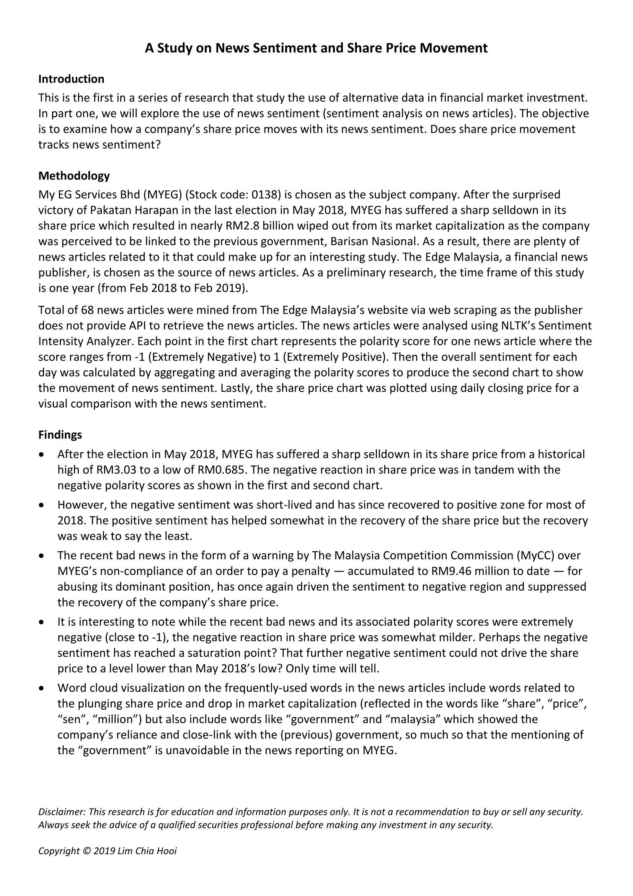
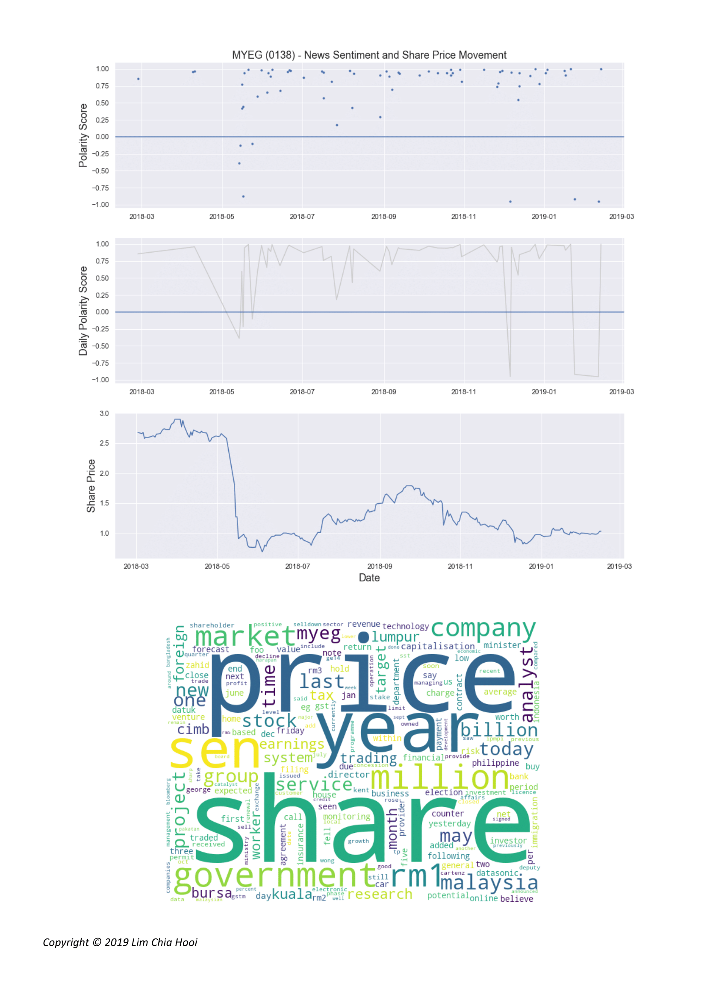
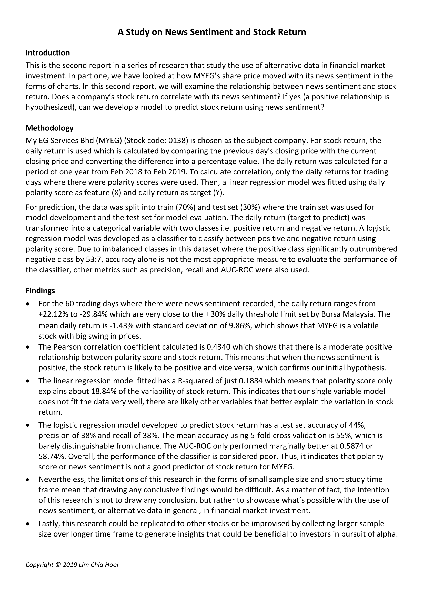
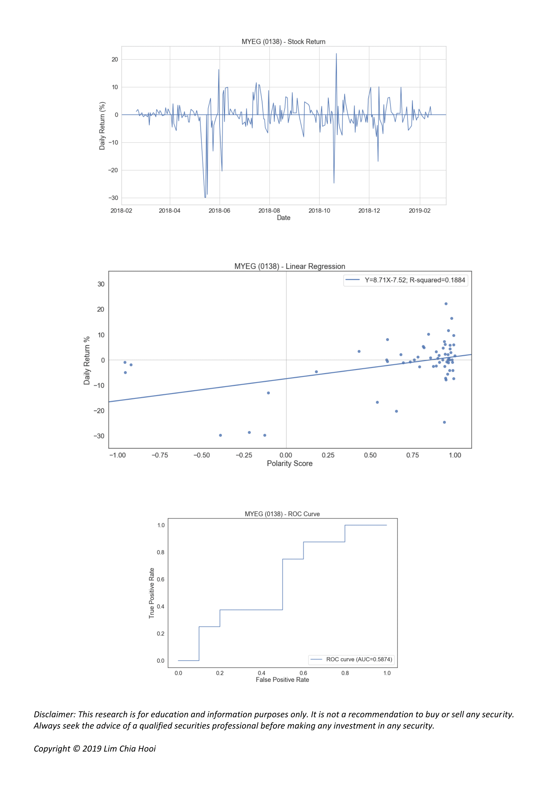

# A Study on News Sentiment and Stock Return
This repo contains my first and second research that explore the use of news sentiment (sentiment analysis on news articles) in stock investment. These are part of a series of research that study the use of alternative data in financial market investment. As this is a commissioned project, the code repo is not open-sourced, only excerpts of the full reports are uploaded. If you are interested to engage my services, feel free to contact me via my LinkedIn (https://www.linkedin.com/in/limchiahooi) or GitHub Pages (https://limchiahooi.github.io/). If you are from nonprofit organizations that are working on interesting problems and need people to help out with your data science or data cleaning processes, feel free to contact me as well.

#### Part 1
File name: myeg_news_sentiment.pdf  
Executive Summary: In part one, we will explore the use of news sentiment (sentiment analysis on news articles). The objective is to examine how a company’s share price moves with its news sentiment. Does share price movement tracks news sentiment? My EG Services Bhd (MYEG) (Stock code: 0138) is chosen as the subject company.

#### Part 2
File name: wmyeg_news_sentiment_2.pdf  
Executive Summary: In part one, we have looked at how MYEG’s share price moved with its news sentiment in the forms of charts. In this second report, we will examine the relationship between news sentiment and stock return. Does a company’s stock return correlate with its news sentiment? If yes (a positive relationship is hypothesized), can we develop a model to predict stock return using news sentiment?

---
#### Part 1

---

#### Part 2

